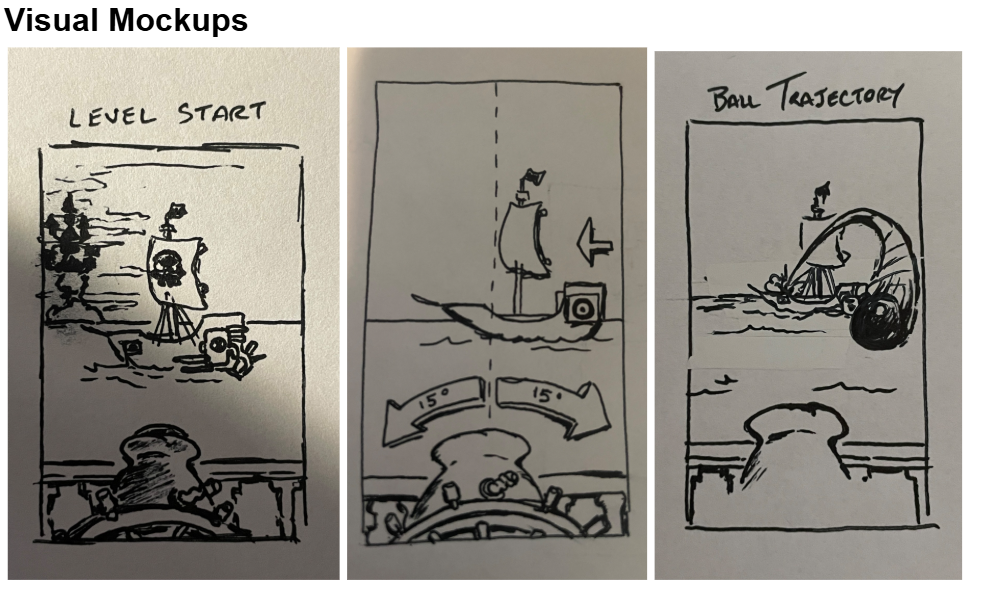
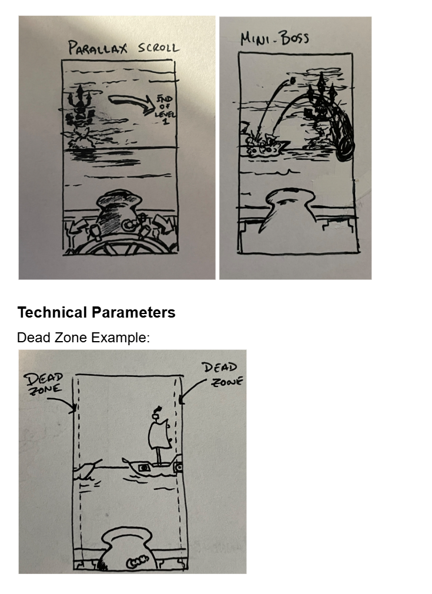
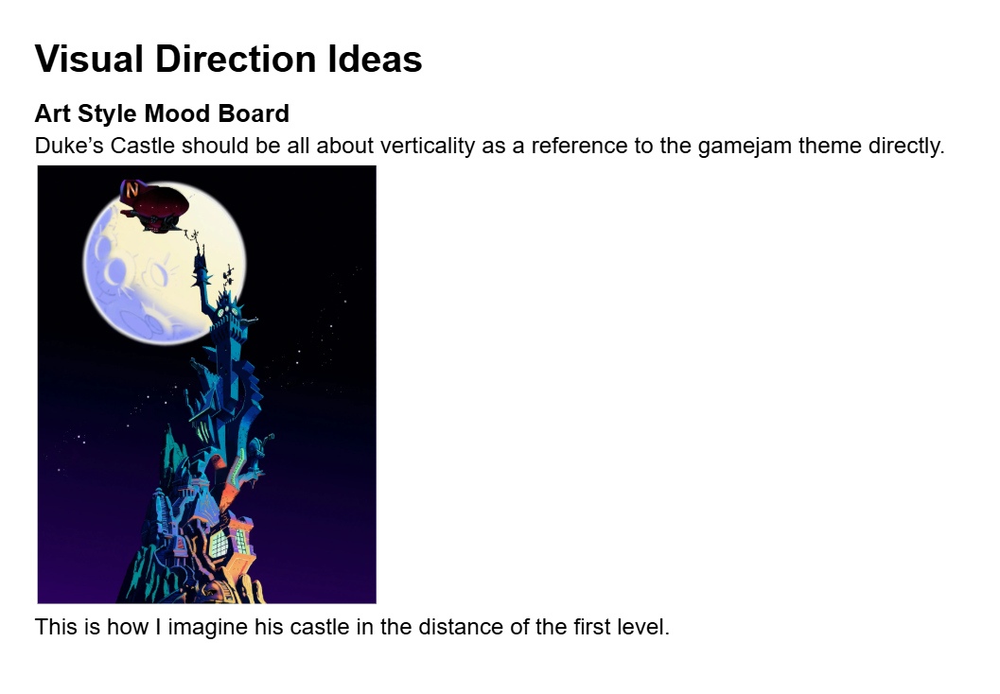
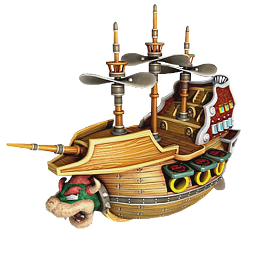
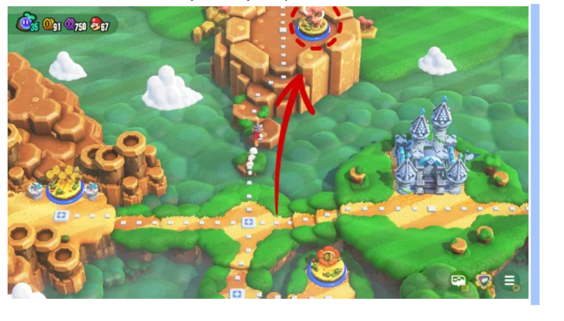
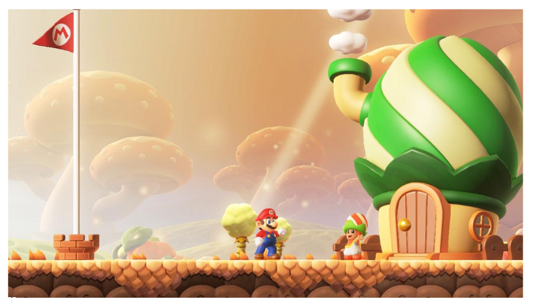

# Down-The-Duke! — Game Design Document (GDD)

this game design document is just an WIP document that should help visualize the core game concept, but is not a
documentation of the real game. It will be changed later and should only be used as reference.

## Game Overview

**Title**: Down-The-Duke! (working title)
Genre: Hypercasual First-Person Arcade Shooter
Platform: Mobile (portrait mode - 1170 x 2532 or equivalent iOS/Android resolution)
Player Viewport: Behind the cannon
Art Style: 2D pre-rendered sprites inspired by Mario Wonder or Donkey Kong Country
Art Direction: maybe it’s pirate-industrial?
See Visual Direction for a quick pointer.
The Story
Brandish your ship’s cannon in a vengeful assault against the vertically challenged Duke B. Trayal! Blast enemy ships
and parry mid-air cannon fodder as you climb the Duke’s fortified island and destroy his Castle of Verticality!
Game Structure
Level 1 — The Voyage (Static)
Introduces the combat mechanics and enemy ship encounters.

Sea 1-A
Introduces:
Aiming
Standard shots
Charged shots
Ship sinking mechanics - blow up the nuclear power cells onboard
Wind resistance mechanic
Wind Resistance is counted from 0 and increases by 0.1.
Strong winds occur around 3 wind speed.
Gameplay
At Level Start, an enemy Carrack is center-frame–ready to be destroyed.
Phase 1
Fire at the hole in the ship’s power cell and sink the first Carrack (2 hits).
Sinking the first ship begins the game and each ship enters one-by-one.
Ship 2 enters and halts near the center-screen. Sink it.
Ship 3 enters and ushers in Phase 2.

Phase 2
A gust throws off your aim; account for the wind resistance!
Winds will drift ships slightly from their starting point.
Fire at the power cell and sink Ship 3. Look! More incoming!
Ships 4 and 5 enter. Wind resistance increases to 2. Sink one.
Wind resistance increases to 3 as the remaining ship floats hopelessly alone.
Say goodbye
Sea 1-B
Introduces:
Mid-air cannonball parrying and deflecting
Timing Enemy Fire - it takes 2.25 seconds for a black cannonball to hit your ship.
Red enemy cannonballs
Mini-boss encounter for Auto-Blast power-up

Gameplay
Before Level Start, or Level Interlude: a Caravel ship enters (1 hit). Caravel ships are the only ships that can enter
and exit the playfield. They contain power-ups or extra ammunition. Hit one!

At Level Start, an unarmored Carrack enters. Hit the ship and witness a return fire!

Phase 1
Ship 1 fires back a black cannonball (black shot)
Parry the oncoming ball by firing into it. The Player must successfully parry an oncoming ball before they advance into
the next sequence.
Ship 1 fires another black shot, however, this time the trajectory is on the right side.
Parry!
Ship 1 reloads – reload times are 4-6 sec (we’ll playtest this)
When a ship’s cannon reloads, it will look down and a cloud puff comes out.
Once it reloads, it aims up and the barrel will glint before firing again.
Phase 2
An armored Ship 2 enters! (5-6 hits) Armored ships are hostile and fire as soon as they enter the playfield, but they
cannot fire immediately because of a dead zone.
The dead zone is a small, no-fire zone between the edge of the frame and the playfield–the area the player can interact.
This zone favors the player.
Ship 2 fires 2 black cannonballs.
Parry. Return fire!
Ship 2 will reload for about 4-6 seconds. After it reloads, it will fire a red cannonball.
Red Cannonballs are much slower than Black Cannonballs. They wobble violently in the air (think Kirby) and take about 4
seconds to hit.
Hitboxes are bigger than black cannonballs.
Ship 2 will alternate between two blacks and two reds. Parry.
The last red cannonball sinks the ship.

Phase 3
Ships 3 & 4 enter. One of them is unarmored and the other is armored.
Parry and attack.
Once Ship 3 is destroyed, wind resistance blows in.
Mini-Boss
Brief Level Interlude: a Caravel ship appears. Sink it to earn an invulnerability power-up.

A Galley, an armored long ship, slowly appears on-screen...
Fires a barrage of black and red cannonballs in this pattern:
Waterfall pattern: front-to-back, back-to-front
2 shots on the left side, and 2 shots on the right side.
Reload… Repeat and the pattern becomes randomized a second time.  
Parry and fire back at the targets during reloads. Watch it sink!
The Player is awarded full-health with an extra health bar, and an Auto-Blast power-up for the next stage.

Level Complete!

Visual Mockups
mobile portrait: 

Design Parameters
Parallax Scroll
Clouds
Duke’s Castle atop the island from left (level start) to right (level end).
Level 2 — Fortress Ascent (Vertical Scroller)
A vertical assault sequence where the player’s ship ascends the Duke’s island tower using a chain-climbing platform. The
Player View is oriented behind the cannon.

Introduces:
Vertical scrolling combat
Mini Fortresses (teaches final boss mechanics)
Blast tower weak points
Environmental hazards
Rapid fire segments

Gameplay
Before Level Start, an overworld map is shown to orient the Player before the ascent.

At Level Start, we face the side of the Duke’s tall island fortress. Waves splash against the crags as a chain-lift
mechanism clamps onto the giant metal chains. You begin to ascend, but notice red alarm lights.

You rise to a mini power cell factory. Cannons aim at you and open fire. Careful they’re closer to you now than before.

Phase 1
Blast the enemy fire, wait for reloads which are cannon overheating, when it overheats, the vents will open. Blast in
the doors, blow it up and ascend.
Withstand a barrage of cannon fire as you ascend to the next phase.
Phase 2
A more intricate power-cell factory with more cannons. Parry and punish openings.
Survive more cannon fire as you ascend into the next Phase.
Phase 3
Back up the final power cell factory by blasting into the openings. Think of a pinball game, but you’re shooting into
the hole and the balls collect into a chamber and blow up the machine itself. This machine is connected to the final
level: the Duke’s Castle of Verticality.
Level 3 — The Duke’s Castle of Vicious Verticality
(i think he’s compensating for something)
Objectives:
Disable cannons
Damage castle weak points
Blast open iron gate protecting the Fortress interior
Fire into the exposed castle interior to defeat the Duke once-and-for-all.

Duke B.Trayal has a few tricks up his sleeve. He’ll fire a massive red shot that takes multiple shots to send back.
He’ll spray multiple black shots across the sky called the Fodder of B. Trayal.
His castle’s weak spots are split up into 5 different parts. You can only target these sections when they are being
reloaded. You’ll see this when the cannons look down and a gauge appears above them. Each cannon takes 5 shots to
destroy. Duke has two floors of his castle armed with cannons. The center cannon is his big cannon and it can fire
either a massive red shot or the deadly black shot.
The black shot takes 10 hits to explode. Do it before it reaches you. It is most certainly, certain death.
The red shot takes 8 hits before it is sent back. If returned, the damage disables the large cannon. Blow it up first to
alleviate a potential game over.
Duke can blast your cannonballs out of the air and can return your charge shots if you’re not careful.
Time the moment the cannons are being reloaded to strike the castle or his defenses. You can beat the Duke if you hit
all of his weak spots, however, destroying his cannons first will make blasting open the iron gate of his Fortress that
much easier.

Mega Cannon Mip that shoots a giant red or black cannonball
4 Cannon Mip locations
4 Castle Weak Points
2 Iron Gate barriers

Mechanics Quick Sheet
Player Mechanics
Health
Player begins each level with 5 health bars
Health does not regenerate, but can be picked up from downed ships
Player loses when health reaches 0
Low Health is indicated by visual changes: cracked cannon, splintered railings, a gradual darkening of the wood onboard
Cannonball Ammo
Player has 4 cannonballs to shoot before needing to reload
The first cannonball becomes visible from the tip of the cannon
The remaining 3 ammunitions are represented in UI
A reload takes x seconds (we’ll playtest)
During a reload, the tip of the cannon is empty
Once reloaded, a cannonball is visible at the top of the barrel
Cannon Controls and Special Attacks
Aiming
Player controls a large aiming wheel that pivots the cannon
Slide finger left/right to rotate the cannon
This can be done anywhere on-screen for ease-of-use
Cannon rotates within a 30-degree range; 15-degree left/right of middle screen
Controls should feel responsive and precise
Standard Black Shot
Tap to fire
Baseline cannonball speed and damage
Damage: 1 damage point (can be defined however you like)
Speed: 1 speed (can be defined however you like)
Intercepts black and red shots
Charged Black Shot
Uses 2 cannonballs for double damage (2.5x ball damage, 1.5x increase ball speed)
Double tap and hold
Hold duration: 1–1.3 seconds; a burning fuse line represents the time to release the charged attack
Careful: Hold for too long and the cannon will backfire!
Receive -2 health
Player can aim while charging
Rips through black shots
Enemy Cannonball Mechanics
Black Cannonballs (Black Shots)
Standard enemy projectile
Explodes if intercepted
Damages player ship on impact (-1 health)
Impact ship in 2.25 seconds
Red Cannonballs (Red Shots)
Slower movement
Aggressive wobbling trajectory (think Kirby)
Can be deflected back at enemies
Designed around timing-based parries
Cannonball Trajectory
The trajectory of an enemy cannonball is situated on a 30-degree angle and flies on an arc, so it is easily spotted
on-screen. The trajectory should switch based on the side of the ship the cannons are firing from.
Advanced Mechanics
Charged Shot Intercept
If a charged shot collides with an incoming cannonball:
First cannonball explodes
Second cannonball continues into enemy ship
Damage is reduced slightly:
1.25× stronger than a standard black shot
Catch-Can Mechanic
If an enemy cannonball somehow flies into the player’s cannon barrel:
Projectile is caught
Can immediately be fired back for Double Damage and double the speed
Enemy Ships
Enemy ships enter from left or right side of screen
Ships stop near center-screen
Slowly drift left or right during windy segments
How to Sink
Each ship contains a red-and-white striped target. If you land a direct hit on the target, you deal max damage (1 hit
point). If you hit off-target, you deal partial damage (0.25 hit point)
Caravel (Small Ship)
1 hit to sink
May reward:
“Golden Seal” invulnerability OR extra health
Moves in and out of the playing field quickly
Carrack (Medium Ship)
2–4 hits to sink
Fires 1 black shot or 1 red shot at a time
Armored Carrack
5-6 hits to sink
Fires 2 black shots at a time
Mini-Boss Ship
Armored Galley (Long Ship)
8–9 hits to sink
Fires different shots in a barrage in a waterfall pattern.
Awards health and Auto Blast power-up.

Tower Enemies
Bog-Dwarves
1 health
Throw stones
Deal -0.25 health
Cannon Mips
2 health
Fire black shots
Deal -1 health
Fortress Power Sources
3 health
Fire red shots

Fortress Power Sources are designed to pre-emptively teach Final Boss mechanics.
Destroy the Cannon Mips
Deflect red shots into the Red Cannon Mip
Blast the gate to pieces and fire a few shots into the fortress
Fortress Power Source explodes

Combat Feedback
Ship Damage Visualization
Enemy ships progressively show:
Cracks
Cannonball holes
Health bars appear once combat begins.
Direct Hit
Enemy flashes bright white.
Off-Target Hit
Enemy flashes dull yellow.

Visual Direction Ideas

Art Style Mood Board
Duke’s Castle should be all about verticality to reference the gamejam theme directly.

This is how I imagine his castle in the distance of the first level.

The ships should carry a simplistic and stylized look similar to Nintendo for fast prototyping.

Environment should be stylistically simple too, like in Mario Wonder

Technical Sheet
Parallax for the Island and Duke’s Castle in the distance. It should start frame left and move frame right by the end of
Level 1.
Design Pillars

1. Precision Cannon Combat
   Every shot matters. Accuracy rewards faster kills and efficient ammo usage.
2. Fast Arcade Feedback
   Big explosions, dramatic impacts, and readable hit reactions keep combat satisfying.
3. Risk vs Reward
   Charged shots and Catch-Can mechanics reward skilled timing but create vulnerability.
4. Escalating Spectacle
   Combat evolves from small naval skirmishes into a massive castle siege.

Possible Future Features
Endless survival mode
Additional ship types
Alternate cannons
Environmental hazards
Boss fleet encounters
Combo scoring system
Cosmetic ship customization
Difficulty modifiers
